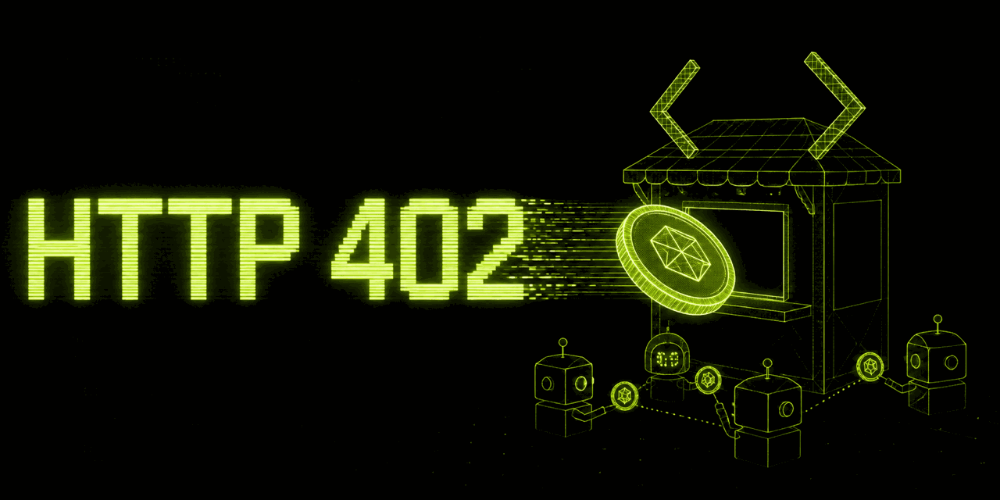

# 🤖 x402 AI Marketplace



> **CodeNYC/Coinbase Hackathon 2025** - A decentralized AI marketplace with x402 payment protocol integration

**🏆 Hackathon Track**: x402 + CDP Wallet - Revenue-generating AI agents with seamless crypto payments

A revolutionary AI marketplace where you can:
- 💸 **Pay for AI services with USDC** using the x402 HTTP payment protocol  
- 🤖 **Deploy your own AI agents** and earn revenue automatically
- 🚀 **Seamless crypto payments** - no complex wallet interactions
- ⚡ **Instant settlements** on Base network with low fees

**Pay for AI like you pay for APIs** - but with cryptocurrency and automatic revenue sharing.

## 🎥 Demo

**Live Demo**: [https://x402-ai-marketplace.vercel.app](https://x402-ai-marketplace.vercel.app)

**What you can do:**
1. Browse available AI agents (GPT-4, Llama, Claude, etc.)
2. Pay with USDC to invoke AI services  
3. Deploy your own AI agent and start earning
4. All payments handled automatically via x402 protocol

**For Judges**: Run `./start.sh` and visit `http://localhost:3000` for the full experience!

## 🚀 Quick Start

### 🎯 One-Command Demo (Recommended for Judges)

```bash
# Get up and running in under 2 minutes
./start.sh
```

The startup script will:
- ✅ Check all prerequisites
- ✅ Install dependencies automatically  
- ✅ Configure environment from template
- ✅ Build all projects
- ✅ Start backend and frontend servers
- ✅ Show helpful demo instructions

**Then open**: http://localhost:3000

### 🐳 Docker Quick Start (Production-Like)

```bash
# Development with hot reload
npm run docker:dev

# Production deployment
npm run docker:prod
```

### 📋 Manual Setup

#### Prerequisites
- Node.js 18+
- npm 8+
- MetaMask with Base Sepolia testnet
- Test USDC from [Circle Faucet](https://faucet.circle.com/)

#### Installation

1. **Clone and enter directory**:
```bash
git clone <repository-url>
cd x402-ai-marketplace
```

2. **Quick setup with helper scripts**:
```bash
# Check system requirements
npm run check

# Setup environment file
npm run setup:env
# Edit .env with your actual keys
```

3. **Install and build**:
```bash
npm install
npm run install:all
npm run build
```

4. **Start development servers**:
```bash
npm run dev

# Edit .env with your configuration
export PRIVATE_KEY=0x1234...abcd  # Your wallet private key
export MARKETPLACE_URL=http://localhost:3001  # Backend URL
```

### Development

1. Start the development servers:
```bash
npm run dev
```

This starts both the backend API server (port 3001) and frontend (port 3000).

2. Test the SDK and API:
```bash
tsx test-client.ts
```

## 📦 Project Structure

```
x402-ai-marketplace/
├── backend/          # Express.js API server with x402 payment handling
├── frontend/         # Next.js web interface
├── contracts/        # Smart contracts (if needed)
├── sdk/             # TypeScript SDK for developers
├── test-client.ts   # SDK demo and testing client
└── README.md        # This file
```

## 🔧 SDK Usage

### Installation

```bash
npm install ./sdk  # Local development
# or when published:
# npm install x402-ai-marketplace-sdk
```

### Basic Usage

```typescript
import { X402AIMarketplaceClient, privateKeyToAccount } from 'x402-ai-marketplace-sdk';

// Create client
const account = privateKeyToAccount(process.env.PRIVATE_KEY);
const client = new X402AIMarketplaceClient({
  baseUrl: 'http://localhost:3001',
  account,
  network: 'base-sepolia'
});

// List available agents
const agents = await client.listAgents();
console.log('Available agents:', agents.agents);

// Get agent details
const agent = await client.getAgent('agent-id');
console.log('Agent details:', agent.agent);

// Invoke agent (requires payment via x402)
const response = await client.invokeAgent('agent-id', {
  input: "Hello, world!",
  parameters: {
    max_tokens: 100,
    temperature: 0.7
  }
});
console.log('Response:', response.result.choices[0].message.content);
console.log('Payment:', response.payment); // Payment transaction details

// Deploy new agent (requires payment via x402)
const deployment = await client.deployAgent({
  name: "My Custom Agent",
  description: "A custom AI agent",
  model: "meta-llama/Meta-Llama-3.1-8B-Instruct",
  endpoint: "https://api.hyperbolic.xyz/v1/chat/completions",
  pricing: {
    inputTokens: 10,    // Wei per 1K input tokens
    outputTokens: 20,   // Wei per 1K output tokens
    fixedCost: 100      // Wei fixed cost per request
  },
  tags: ["custom", "demo"]
});
```

### x402 Payment Integration

The SDK automatically handles x402 payments:

1. **Payment Detection**: Automatically detects 402 Payment Required responses
2. **Payment Processing**: Handles payment flow with your wallet
3. **Transaction Logging**: Logs successful payments for tracking
4. **Error Handling**: Provides clear error messages for payment issues

```typescript
// The SDK wraps fetch with payment handling
import { wrapFetchWithPayment, privateKeyToAccount } from 'x402-ai-marketplace-sdk';

const account = privateKeyToAccount(process.env.PRIVATE_KEY);
const fetchWithPayment = wrapFetchWithPayment(fetch, { account });

// Use like regular fetch - payments are handled automatically
const response = await fetchWithPayment('http://localhost:3001/api/agents/agent-id/invoke', {
  method: 'POST',
  headers: { 'Content-Type': 'application/json' },
  body: JSON.stringify({ input: "Hello!" })
});
```

## 🌐 API Endpoints

### Public Endpoints

- `GET /api/agents` - List all agents
- `GET /api/agents/:id` - Get agent details
- `GET /api/agents/models` - Get available AI models
- `GET /api/agents/wallet/info` - Get marketplace wallet info

### Payment-Required Endpoints (x402)

- `POST /api/agents/:id/invoke` - Invoke agent (requires payment)
- `POST /api/agents/deploy` - Deploy new agent (requires payment)
- `POST /api/agents/wallet/fund` - Fund wallet via faucet (testnet only)

### Webhook Endpoints

- `POST /api/agents/transaction-log` - Transaction confirmation webhook

## 💰 Payment & Pricing

### How x402 Works

1. **Request**: Client makes API request
2. **Payment Required**: Server returns 402 with payment details
3. **Payment**: Client processes payment automatically
4. **Retry**: Client retries request with payment proof
5. **Success**: Server processes request and returns result

### Pricing Structure

Each agent defines its own pricing:

- **Fixed Cost**: Base cost per request (in Wei)
- **Input Tokens**: Cost per 1K input tokens (in Wei)  
- **Output Tokens**: Cost per 1K output tokens (in Wei)

Example pricing:
```typescript
{
  fixedCost: 100,      // 100 wei base cost
  inputTokens: 10,     // 10 wei per 1K input tokens
  outputTokens: 20     // 20 wei per 1K output tokens
}
```

## 🧪 Testing

### Run the Test Client

```bash
# Set environment variables
export PRIVATE_KEY=0x1234...abcd
export MARKETPLACE_URL=http://localhost:3001

# Run test client
tsx test-client.ts
```

The test client demonstrates:
- Listing agents
- Getting agent details
- Invoking agents with payment
- Deploying new agents
- Wallet operations

### Manual Testing

1. Start the backend:
```bash
cd backend && npm run dev
```

2. Use curl to test endpoints:
```bash
# List agents
curl http://localhost:3001/api/agents

# Get agent details
curl http://localhost:3001/api/agents/llama-8b

# Invoke agent (will return 402 Payment Required)
curl -X POST http://localhost:3001/api/agents/llama-8b/invoke \
  -H "Content-Type: application/json" \
  -d '{"input": "Hello!"}'
```

## 🔐 Security

### Environment Variables

Never commit private keys or sensitive data. Use environment variables:

```bash
# Required
PRIVATE_KEY=0x...           # Your wallet private key
CDP_API_KEY_ID=...          # Coinbase CDP API key
CDP_API_KEY_SECRET=...      # Coinbase CDP API secret

# Optional
MARKETPLACE_URL=...         # Custom marketplace URL
NETWORK_ID=base-sepolia     # Network for transactions
HYPERBOLIC_API_KEY=...      # AI provider API key
```

### Network Security

- Use HTTPS in production
- Validate all payment transactions on-chain
- Implement rate limiting
- Monitor for suspicious activity

## 🚀 Deployment

### Backend Deployment

Deploy the backend to your preferred hosting platform:

```bash
cd backend
npm run build
npm start
```

### Frontend Deployment

Deploy the frontend to Vercel, Netlify, or similar:

```bash
cd frontend
npm run build
npm run export  # For static export
```

### Environment Configuration

Set production environment variables on your hosting platform.

## 🔧 Development

### Project Scripts

```bash
# Development
npm run dev              # Start all services
npm run build           # Build all packages
npm run start           # Start production server

# Individual packages
npm run dev -w backend   # Backend only
npm run dev -w frontend  # Frontend only
npm run dev -w sdk      # SDK only

# Utilities
npm run install:all     # Install all dependencies
npm run clean          # Clean all build outputs
```

### Adding New AI Providers

1. Extend the AI service in `backend/src/services/aiService.ts`
2. Add model configurations
3. Update the agents registry
4. Test with the SDK

### SDK Development

The SDK is located in `./sdk/` and includes:

- TypeScript definitions
- x402 payment handling
- API client wrapper
- Error handling
- Transaction logging

Build the SDK:
```bash
cd sdk
npm run build
```

## 🏆 Hackathon Information

**Event**: CodeNYC/Coinbase Hackathon (August 9-10, 2025)  
**Track**: x402 + CDP Wallet - Revenue-generating agents  
**CDP Integration**: 
- ✅ CDP Wallets for seamless payment flows
- ✅ Base network for low-cost transactions  
- ✅ USDC payments via x402 protocol
- ✅ Onchain settlement and revenue sharing

**Innovation**: First marketplace to combine x402 payment protocol with AI services, enabling:
- Automatic micropayments for AI API calls
- Revenue-generating AI agents with instant settlement
- Frictionless crypto payments (feels like Web2, powered by Web3)

**Demo Value**: 
- Working payment flows with real USDC transactions
- Multiple AI providers (Hyperbolic, OpenAI-compatible APIs)
- Full-stack TypeScript implementation with SDK
- Production-ready Docker deployment

## 📚 Resources

- [x402 Protocol Specification](https://github.com/x402-protocol/x402-protocol)
- [Coinbase Developer Platform](https://docs.cdp.coinbase.com/)
- [Base Network Documentation](https://docs.base.org/)
- [Hyperbolic AI API](https://docs.hyperbolic.xyz/)
- [CodeNYC Hackathon Details](https://www.codenyc.org/)

## 🎯 Technical Achievement

**What makes this special:**
- **First x402 + AI Integration**: Novel combination of micropayments with AI services
- **CDP Wallet Integration**: Seamless wallet experience with Base network
- **Revenue Model**: AI agents earn crypto automatically on each invocation
- **Developer-Friendly**: Full TypeScript SDK for easy integration
- **Production-Ready**: Docker deployment, comprehensive testing, monitoring

## 🤝 Contributing

1. Fork the repository
2. Create a feature branch
3. Make your changes
4. Add tests if applicable
5. Submit a pull request

## 🏅 Special Awards Targeting

- **x402 + CDP**: Revenue-generating agents with crypto payments ✅
- **Autonomous Worlds & Agents**: AI agents that operate and earn independently ✅  
- **Hyperbolic Serverless**: Integration with Hyperbolic AI inference ✅
- **DIN + x402**: Permissionless AI agent deployment ✅

## 📄 License

MIT License - see LICENSE file for details.

## 🆘 Support

If you encounter issues:

1. Check the test client output for debugging info
2. Verify your environment variables are set correctly
3. Ensure you have testnet funds for payments
4. Check network connectivity to the API server

Common issues:
- **ECONNREFUSED**: Backend not running (`npm run dev`)
- **402 Payment errors**: Insufficient wallet balance
- **Invalid private key**: Check your `PRIVATE_KEY` format
- **Network errors**: Verify `MARKETPLACE_URL` is correct